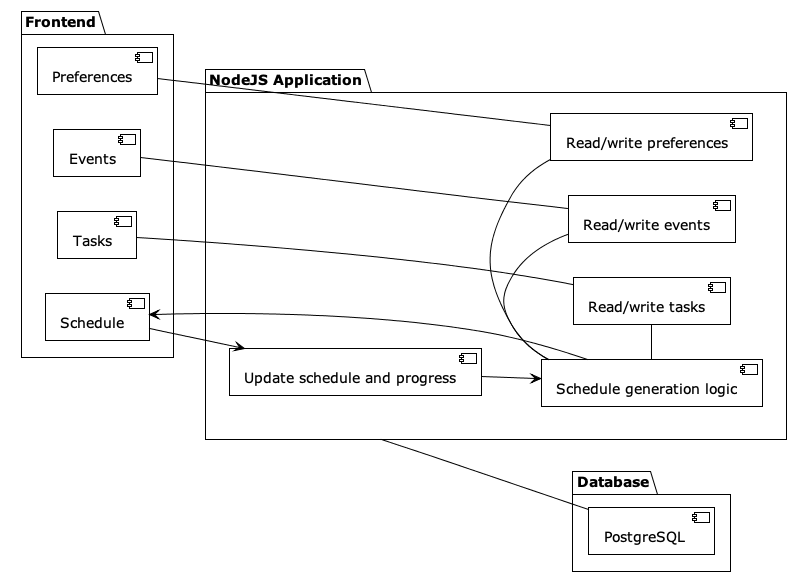

# Dynamic Schedule

Alpha availabe on [Heroku](dynamicscheduler.herokuapp.com).

Welcome to your ideal schedule, as varied or regimented as you like. Collect your tasks and events to automatically generate a schedule to meet your needs. Adjust to find your ideal blend of variety, and block off times of the day to get work done. If a task takes longer than expected, easily adjust your schedule with the click of a button. 

## Core Features
### Task Recording
User can enter tasks with deadline, hours estimated, and type; which then appear on the global task list
### Event Recording
User can enter events with date and time
### Global Preferences
- Repetition: determines how much the routine changes from day to day (holding taskload constant)
- Work times: determines where the scheduler is allowed to place work sessions
- Session length: determines how long the scheduler will assign to work on a single task
- Variety: determines whether subsequent tasks are similar or disparate
### Schedule generation
Based on the preferences, given the task and event lists, and for a specified period of time (i.e. the next 2 weeks), the system generates a schedule that leads to on-time completion of all tasks with time blocked for events, while optimizing for global preferences.
### Dynamic schedule
'Done' button marks current task complete and set next to active.  'Recalculate' button resets schedule to beginning of current task.  With time entered in 'extra time needed' field, schedule resets to end of current task, offset forward by given time.

## Application Architecture

## Database Design
[Link to dbdiagram.io](https://dbdiagram.io/d/6104a0a12ecb310fc3b79989)

## Wireframes
[Link to Figma Board](https://www.figma.com/file/gOQIXCLraoBTbB8gEilh1U/Dyanamic-Scheduler-Wireframe?node-id=0%3A1)
